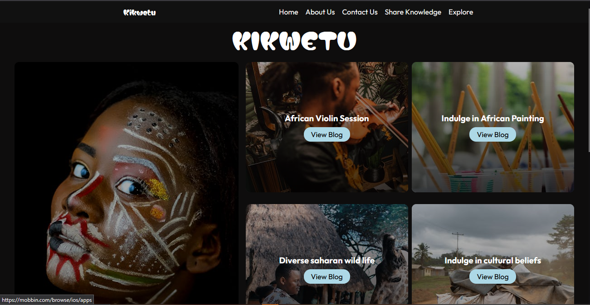

# Kikwetu Blog Website

## This project was bilt for PLP web development last project



- TO view live website please visit

>[WEBSITE-URL]
> - https://plp-webtechnologies.github.io/feb-2025-final-project-and-deployment-charlesricha/


## Overview

🌍 Kikwetu Blog is a web application dedicated to showcasing the vibrant tapestry of Africa. Through engaging articles and stunning visuals, the blog explores African travels, incredible wildlife, diverse cultures, and much more. This project serves as a personal portfolio piece to demonstrate web development skills.

## Technologies Used
    * HTML5
    * CSS3
    * JavaScript 

## Setup and Installation

 **Clone the repository:**
```bash
    git clone https://github.com/PLP-WebTechnologies/feb-2025-final-project-and-deployment-charlesricha.git
    cd kikwetu-blog
```

## Acknowledgements

* Copied the design from **Dribble** from a website Template


## Future Enhancements

* Implement user authentication and commenting system.
* Add social media sharing buttons.
* Improve search functionality.
* Explore different styling and design options.
* Integrate with APIs for richer content (e.g., weather information for travel posts).

## Contact

(Charles Muthui) - (charlesmuthui2006@gmail.com)

